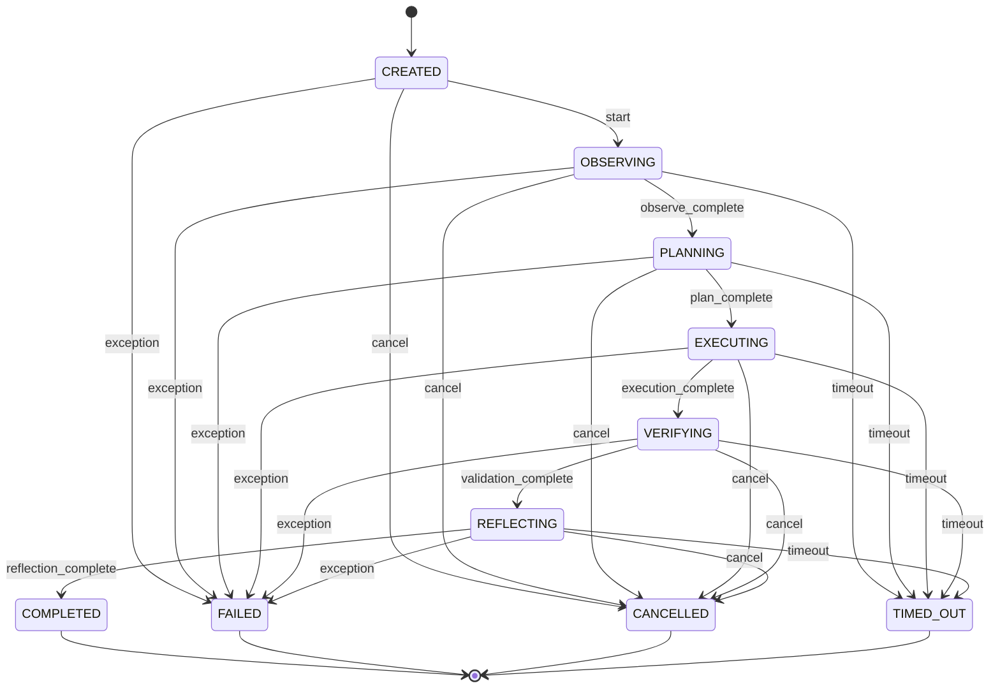

# Loop State Machine

The Loop State Machine controls execution transitions deterministically, ensuring that an agent cannot proceed without completing required stages or bypass validation checks.

## State Transition Matrix

## Transition Management Rules

- **Deterministic Verification**: Every state change triggers `LoopStateMachine.validateTransition` which throws if the path is invalid.
- **Fail-Safe Transitions**: Any uncaught exception instantly transitions the context state to `FAILED`, preserving diagnostic metadata.
- **Timeout Bound Enforcement**: Evaluated on every phase start to prevent zombie run-aways.
- **Explicit Cancellation**: Provides safe abort handles for human operations or supervisor system-wide kill switches.
