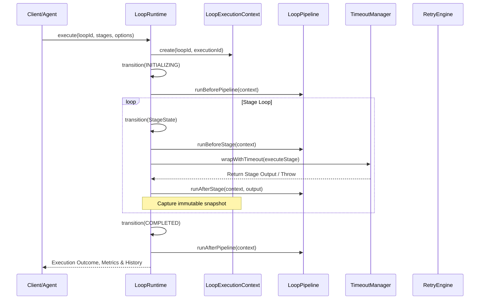
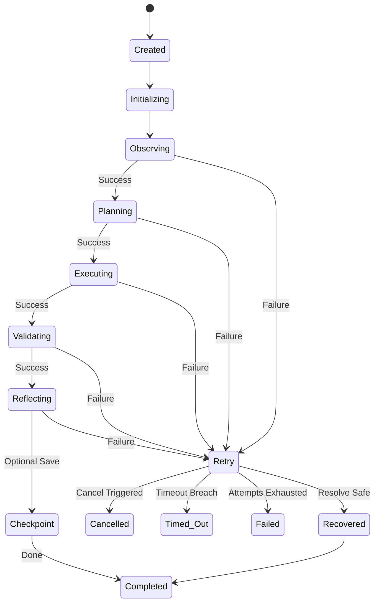

# Loop Runtime Engine (Salience Atlas v5)

## Overview
The `LoopRuntime` is the universal core execution kernel of Salience Atlas. It orchestrates context creation, state transition determinism, checkpointing, cancellation policies, and metric aggregation.

## Sequence Diagram

## State Machine Transition Diagram

