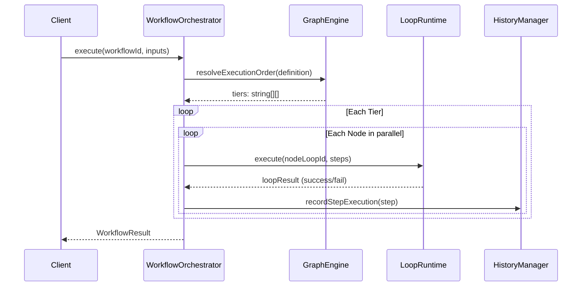

# 22. Workflow Orchestrator
## Salience Atlas v5

The `WorkflowOrchestrator` is the central component responsible for processing, running, and reporting execution results for registered workflows.

### Sequence Diagram

### Core Execution Flow
1. **Resolution**: Inspects the `WorkflowRegistry` for the specified workflow ID.
2. **Context Creation**: Instantiates a unique, isolated `WorkflowExecutionContext`.
3. **DAG Analysis**: Utilizes `WorkflowGraphEngine` to order nodes.
4. **Execution**: Maps node action functions into short-lived `LoopRuntime` stages.
5. **Observability**: Tracks execution metrics and transition paths.
